# Entity Framework Core Deep Explanation

> شرح شامل ومفصل لمشروع Entity Framework Core بالعامية المصرية - من أول سطر للآخر

---

## 1. Project Overview (نظرة عامة على المشروع)

المشروع ده اسمه **EF02** وهو بيوضح إزاي تربط تطبيق C# بـ SQL Server باستخدام **Entity Framework Core**.

بدل ما تكتب SQL بإيدك زي ما كنا بنعمل قديم، EF Core بيعملها عنك أوتوماتيك!

### إيه اللي بيعمله المشروع ده؟
- بيعمل جدول `Departments` في الداتابيز
- بيعمل جدول `Employees` في الداتابيز
- بيعمل CRUD (إضافة، تعديل، حذف، قراءة) على الـ Employees
- بيشرح 4 طرق مختلفة لربط الكلاسات بالداتابيز

---

## 2. Folder Structure Diagram (شجرة الملفات)

```
EF02/
├── Context/
│   ├── EnterpriseDBContext.cs       ← الكلاس الرئيسي اللي بيمثل الـ Session مع DB
│   └── DepartmentConfiguration.cs  ← إعدادات جدول Departments بـ Fluent API
│
├── Entities/
│   ├── Department.cs                ← كلاس الـ Department (POCO Class)
│   └── Employee.cs                  ← كلاس الـ Employee (POCO Class)
│
├── Migrations/
│   ├── [timestamp]_AddEmployeeTable.cs   ← Migration الـ Employees
│   ├── [timestamp]_DepartmentsTable.cs   ← Migration الـ Departments
│   └── EnterpriseDBContextModelSnapshot.cs ← Snapshot الحالة الحالية
│
└── Program.cs                       ← نقطة البداية - فيها الـ CRUD operations
```

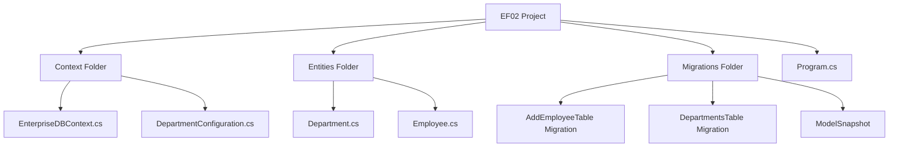

---

## 3. What is Entity Framework Core? (إيه هو EF Core؟)

تخيل إنك بتشتغل على قاعدة بيانات وبتكتب SQL زي:

```sql
INSERT INTO Employees (Name, Age, Email, salary) VALUES ('Ibrahim', 26, 'test@gmail.com', 50000)
```

ده مرهق ومحتاج تكتب كود كتير. هنا بييجي دور **Entity Framework Core**.

### EF Core هو ORM (Object Relational Mapper)

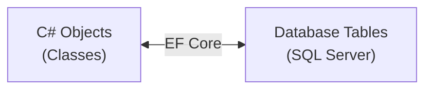

يعني بدل ما تكتب SQL، بتكتب C# وEF Core بيحوّلها لـ SQL أوتوماتيك!

### ليه نستخدم EF Core؟

| بدون EF Core | مع EF Core |
|---|---|
| بتكتب SQL بإيدك | EF بيكتب SQL عنك |
| لازم تعرف SQL كويس | بتتعامل مع Objects |
| صعب تعمل تغييرات في الـ Schema | Migrations بتتعامل مع التغييرات |
| كود كتير وممل | كود أقل وأوضح |

---

## 4. DbContext Explained (شرح الـ DbContext)

### إيه هو DbContext؟

الـ **DbContext** ده زي "الوسيط" بين برنامجك وقاعدة البيانات. هو اللي بيفتح الـ Connection، بيبعت الأوامر للداتابيز، وبيجيب النتايج.

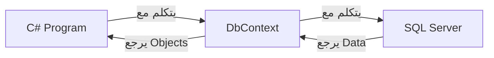

### الكود بتاعنا:

```csharp
public class EnterpriseDBContext : DbContext
{
    protected override void OnConfiguring(DbContextOptionsBuilder optionsBuilder) { ... }
    protected override void OnModelCreating(ModelBuilder modelBuilder) { ... }
    
    public DbSet<Department> Departments { get; set; }
    public DbSet<Employee> Employees { get; set; }
}
```

### شرح كل جزء:

#### أ) OnConfiguring - "رقم التليفون بتاع الداتابيز"

```csharp
protected override void OnConfiguring(DbContextOptionsBuilder optionsBuilder)
{
    optionsBuilder.UseSqlServer(
        "server=IBRAHIMSHAFIQ\\SQLEXPRESS; database=EnterpriseDb; Trusted_Connection=true; TrustServerCertificate=true;"
    );
}
```

**ليه بنعمله؟**
عشان نقول للـ EF Core: "إنت هتتكلم مع SQL Server اللي على الجهاز ده".

**الـ Connection String بتاخد إيه؟**

| الجزء | معناه |
|---|---|
| `server=IBRAHIMSHAFIQ\\SQLEXPRESS` | اسم الـ SQL Server instance على جهازك |
| `database=EnterpriseDb` | اسم الداتابيز (لو مش موجودة هيعملها!) |
| `Trusted_Connection=true` | استخدم Windows Authentication (مش محتاج username/password) |
| `TrustServerCertificate=true` | ثق في الـ SSL Certificate حتى لو مش موثق |

#### ب) OnModelCreating - "تعليمات بناء الداتابيز"

```csharp
protected override void OnModelCreating(ModelBuilder modelBuilder)
{
    modelBuilder.ApplyConfiguration(new DepartmentConfiguration());
}
```

**ليه بنعمله؟**
عشان نقول لـ EF Core إزاي يبني الجداول في الداتابيز. هنا بنقوله يطبق الإعدادات اللي كتبناها في `DepartmentConfiguration`.

**`ApplyConfiguration`** بتقوله: "خد الإعدادات دي وطبقها".

ولو عندك كتير من الـ Configurations، ممكن تستخدم:
```csharp
modelBuilder.ApplyConfigurationsFromAssembly(Assembly.GetExecutingAssembly());
// ده بيطبق كل الـ Configurations الموجودة في الـ Project أوتوماتيك
```

#### ج) DbSet - "بوابة الجداول"

```csharp
public DbSet<Department> Departments { get; set; }
public DbSet<Employee> Employees { get; set; }
```

**ليه بنعمله؟**
كل `DbSet<T>` بيمثل جدول في الداتابيز. من خلاله بتعمل كل عمليات الـ CRUD.

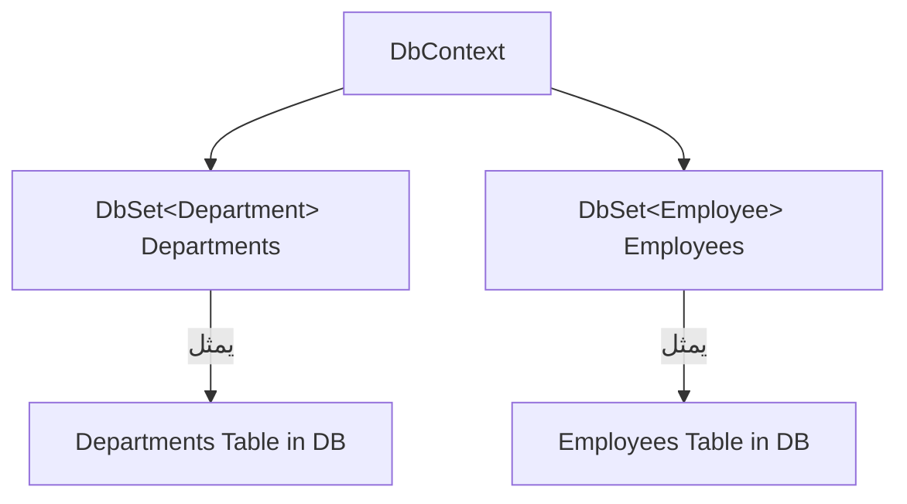

#### د) DbContext Lifecycle (دورة حياة الـ DbContext)

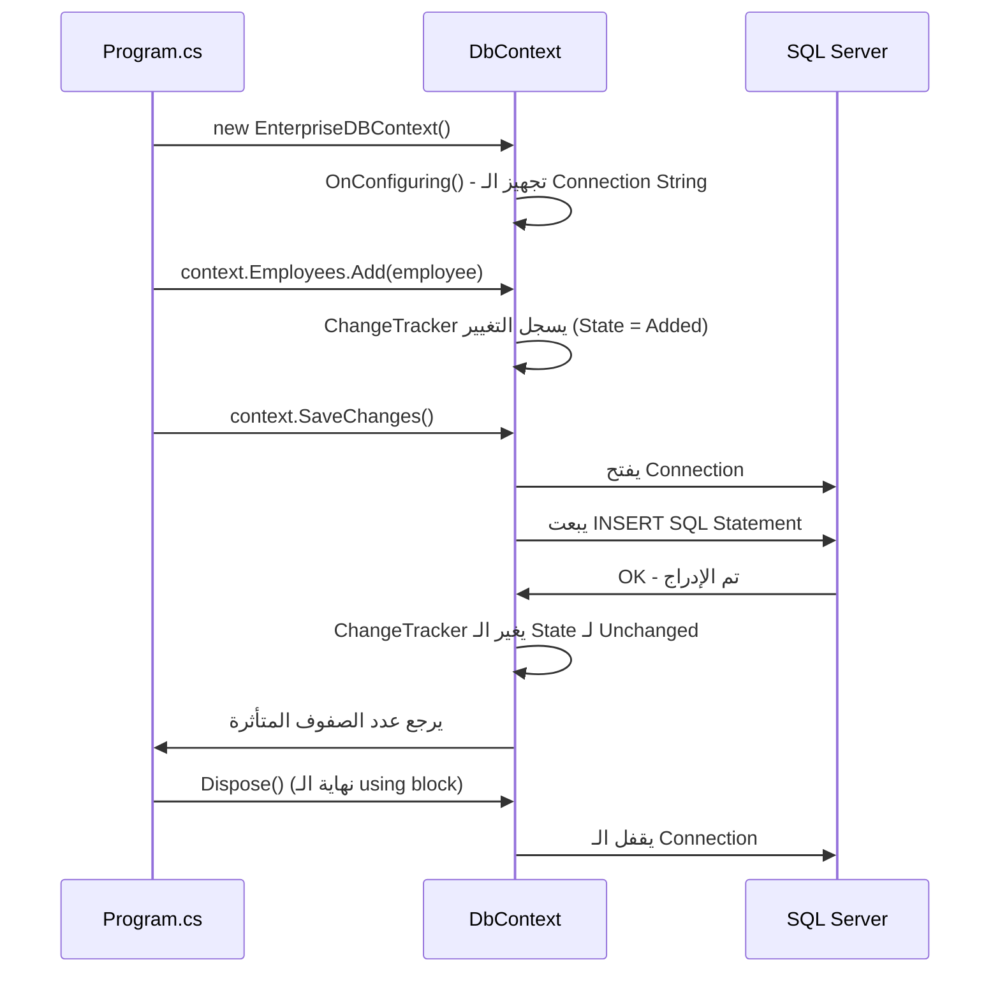

#### هـ) ChangeTracker - "المراقب الخفي"

الـ `ChangeTracker` هو جزء من الـ DbContext بيراقب كل object بتتعامل معاه. هو اللي بيحدد إيه اللي اتغير وبيبعته للداتابيز لما تعمل `SaveChanges()`.

---

## 5. Entity Classes Explained (شرح كلاسات الـ Entities)

### إيه هو POCO Class؟

الـ **POCO** اختصار لـ **Plain Old CLR Object**.

يعني كلاس عادي جداً مش بيورث من حاجة خاصة ومش فيه غير Properties.

```csharp
// ده POCO Class
public class Department
{
    public int DeptId { get; set; }
    public string Name { get; set; }
    public DateTime YearOfCreation { get; set; }
}
```

EF Core بياخد الكلاس ده ويحوله لجدول في الداتابيز.

### Department.cs

```csharp
public class Department
{
    public int DeptId { get; set; }        // هيبقى Primary Key
    public string Name { get; set; }       // هيبقى نص
    public DateTime YearOfCreation { get; set; }  // هيبقى تاريخ
}
```

الكلاس ده مش فيه أي Attributes - لأننا بنستخدم **Fluent API** في `DepartmentConfiguration`.

### Employee.cs

```csharp
[Table("Employees")]
public class Employee
{
    [Key]
    public int EmpId { get; set; }

    [Required(ErrorMessage = "Name Field is Required")]
    [StringLength(50, MinimumLength = 5, ErrorMessage = "Text Length Must be in between 5 to 50")]
    [MaxLength(50)]
    [MinLength(5)]
    public string Name { get; set; }

    [DataType(DataType.Currency)]
    [Column(TypeName = "money")]
    public decimal salary { get; set; }

    [Range(18, 60, ErrorMessage = "Invalid Age Range")]
    public int? Age { get; set; }

    [EmailAddress]
    [DataType(DataType.EmailAddress)]
    public string Email { get; set; }
}
```

الكلاس ده فيه **Data Annotations** - يعني Attributes فوق كل Property.

---

## 6. Mapping Strategies (طرق الـ Mapping)

في EF Core في 4 طرق تربط الكلاس بالجدول في الداتابيز:

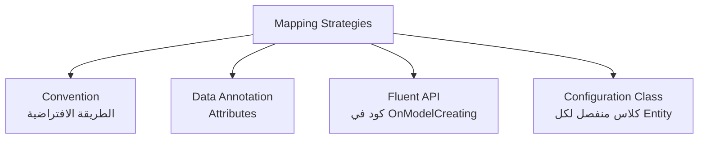

---

### أ) Convention (الطريقة الافتراضية)

```csharp
public class Employee
{
    public int Id { get; set; }        // EF هيعملها PK أوتوماتيك!
    public string Name { get; set; }   // Reference Type → يسمح بـ NULL
    public decimal salary { get; set; } // Value Type → مش بيسمح بـ NULL
    public int? Age { get; set; }      // Nullable → يسمح بـ NULL
}
```

**قواعد الـ Convention:**

| القاعدة | المثال | النتيجة في DB |
|---|---|---|
| Property اسمها `Id` أو `EntityNameId` | `Id` أو `EmployeeId` | Primary Key + Identity(1,1) |
| Reference Types (string, class) | `string Name` | يسمح بـ NULL |
| Value Types (int, decimal) | `decimal salary` | مش بيسمح بـ NULL |
| Nullable Value Types | `int? Age` | يسمح بـ NULL |
| اسم الكلاس | `Employee` | جدول اسمه `Employees` (بيضيف s) |

---

### ب) Data Annotation (الـ Attributes)

```csharp
[Table("Employees")]           // اسم الجدول في الداتابيز
public class Employee
{
    [Key]                       // Primary Key
    public int EmpId { get; set; }

    [Required(ErrorMessage = "Name Field is Required")]
    [StringLength(50, MinimumLength = 5)]
    public string Name { get; set; }
}
```

**شرح كل Attribute:**

#### `[Table("Employees")]`
```csharp
[Table("Employees")]
public class Employee { }
```
بتقول لـ EF: "الجدول ده اسمه Employees في الداتابيز". لو مش كتبتها، هيستخدم اسم الـ DbSet property.

#### `[Key]`
```csharp
[Key]
public int EmpId { get; set; }
```
بتقول لـ EF: "الـ Property دي هي الـ Primary Key". مهمة لو اسم الـ Property مش `Id` أو `EntityId`.

#### `[DatabaseGenerated]`
```csharp
[DatabaseGenerated(DatabaseGeneratedOption.None)]     // مفيش Identity
[DatabaseGenerated(DatabaseGeneratedOption.Identity)] // Identity (زيادة أوتوماتيك)
[DatabaseGenerated(DatabaseGeneratedOption.Computed)] // قيمة محسوبة من الداتابيز
```

| الخيار | معناه |
|---|---|
| `None` | إنت اللي بتحدد القيمة بإيدك |
| `Identity` | الداتابيز بتزودها أوتوماتيك (زي 1, 2, 3...) |
| `Computed` | الداتابيز بتحسبها من كولومنات تانية |

#### `[Required]`
```csharp
[Required(ErrorMessage = "Name Field is Required")]
public string Name { get; set; }
```
بيعمل الـ Column NOT NULL في الداتابيز، وبيديك Error Message للـ Validation.

**الـ SQL اللي بيتعمل:**
```sql
Name nvarchar(MAX) NOT NULL
```

#### `[StringLength]`
```csharp
[StringLength(50, MinimumLength = 5, ErrorMessage = "Text Length Must be in between 5 to 50")]
public string Name { get; set; }
```
بيحدد الطول الأقصى والأدنى للنص. EF Core بيستخدم الـ MaxLength في الداتابيز.

**الـ SQL اللي بيتعمل:**
```sql
Name nvarchar(50) NOT NULL
```

#### `[MaxLength]` و `[MinLength]`
```csharp
[MaxLength(50)]
[MinLength(5)]
public string Name { get; set; }
```
نفس فكرة StringLength بس Attributes منفصلة. `MaxLength` بيأثر على الداتابيز، `MinLength` للـ Validation بس.

#### `[Range]`
```csharp
[Range(18, 60, ErrorMessage = "Invalid Age Range")]
public int? Age { get; set; }
```
للـ Validation بس - مش بيأثر على الـ Schema في الداتابيز. بيتحقق إن القيمة بين 18 و60.

#### `[EmailAddress]` و `[DataType]`
```csharp
[EmailAddress]
[DataType(DataType.EmailAddress)] 
public string Email { get; set; }
```
للـ Validation بس - بيتحقق إن القيمة دي Email صح. `DataType` بيفيد في الـ UI أكتر من الداتابيز.

#### `[Column]`
```csharp
[Column(TypeName = "money")]
public decimal salary { get; set; }
```
بيحدد نوع الـ Column في الداتابيز بالظبط.

**الـ SQL اللي بيتعمل:**
```sql
salary money NOT NULL
```

---

### ج) Fluent API

الـ Fluent API بتكتبه جوه `OnModelCreating` أو في Configuration Class منفصل.

```csharp
protected override void OnModelCreating(ModelBuilder modelBuilder)
{
    modelBuilder.Entity<Department>()
        .HasKey(dept => dept.DeptId)
        .Property(d => d.Name)
            .IsRequired(true)
            .HasMaxLength(50)
            .IsUnicode(false);
}
```

**شرح كل Method:**

#### `HasKey()`
```csharp
builder.HasKey(dept => dept.DeptId);
```
بيحدد الـ Primary Key للجدول.

**الـ SQL اللي بيتعمل:**
```sql
CONSTRAINT PK_Departments PRIMARY KEY (DeptId)
```

#### `Property()` مع `UseIdentityColumn()`
```csharp
builder.Property(nameof(Department.DeptId))
       .UseIdentityColumn(10, 10);
```
بيقول: "الـ Identity يبدأ من 10 ويزيد بـ 10 كل مرة" (10, 20, 30, 40...).

**الـ SQL اللي بيتعمل:**
```sql
DeptId int IDENTITY(10, 10) NOT NULL
```

#### `IsRequired()`
```csharp
builder.Property(d => d.Name).IsRequired(true);
```
بيعمل الـ Column NOT NULL.

#### `HasMaxLength()`
```csharp
builder.Property(d => d.Name).HasMaxLength(50);
```
بيحدد أقصى طول للنص.

#### `IsUnicode(false)`
```csharp
builder.Property(d => d.Name).IsUnicode(false);
```
بيقول: "الـ Column ده مش محتاج يدعم Unicode (عربي وغيره)". النتيجة إن النوع بيبقى `varchar` بدل `nvarchar`. ده بيوفر مساحة في الداتابيز.

**الفرق:**
| `IsUnicode(true)` - الافتراضي | `IsUnicode(false)` |
|---|---|
| `nvarchar(50)` | `varchar(50)` |
| يدعم Arabic, Chinese, etc. | English فقط |
| 2 bytes per character | 1 byte per character |

#### `HasDefaultValueSql()`
```csharp
builder.Property(d => d.YearOfCreation)
       .HasDefaultValueSql("GETDATE()");
```
لو مش بعت قيمة لـ `YearOfCreation`، الداتابيز هتحط فيها التاريخ الحالي أوتوماتيك.

**الـ SQL اللي بيتعمل:**
```sql
YearOfCreation datetime2 NOT NULL DEFAULT (GETDATE())
```

---

### د) Configuration Class (طريقة الـ Configuration المنفصلة)

دي التطوير بتاع الـ Fluent API. بدل ما تحط كل الإعدادات في `OnModelCreating` وتبقى ضخمة، بتعمل كلاس منفصل لكل Entity.

---

## 7. Fluent API Configuration Class (شرح DepartmentConfiguration)

```csharp
public class DepartmentConfiguration : IEntityTypeConfiguration<Department>
{
    public void Configure(EntityTypeBuilder<Department> builder)
    {
        builder.HasKey(dept => dept.DeptId);
        
        builder.Property(nameof(Department.DeptId))
               .UseIdentityColumn(10, 10);
        
        builder.Property(d => d.Name)
               .IsRequired(true)
               .HasMaxLength(50)
               .IsUnicode(false);
        
        builder.Property(d => d.YearOfCreation)
               .HasDefaultValueSql("GETDATE()");
    }
}
```

### ليه بنعمل كلاس منفصل؟

**المشكلة:** لو عندك 10 Entities، الـ `OnModelCreating` هتبقى ضخمة جداً وصعبة القراءة.

**الحل:** كلاس منفصل لكل Entity.

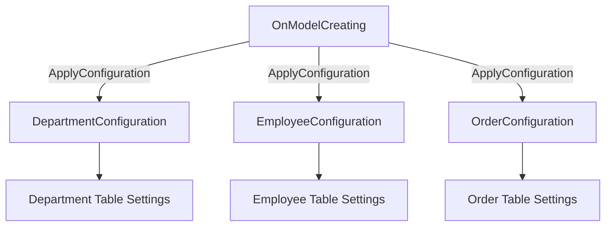

### إزاي بنقوله يطبقها؟

```csharp
// في OnModelCreating
modelBuilder.ApplyConfiguration(new DepartmentConfiguration());

// أو أوتوماتيك يطبق كل الـ Configurations في الـ Project
modelBuilder.ApplyConfigurationsFromAssembly(Assembly.GetExecutingAssembly());
```

### `IEntityTypeConfiguration<T>` إيه ده؟

ده Interface بيقولك: "أي كلاس بيورث مني لازم يعمل method اسمها `Configure`". ده بيضمن إن كل Configuration Class عنده نفس الشكل.

---

## 8. Migrations Explained (شرح الـ Migrations)

### إيه هي الـ Migration؟

الـ Migration ده ملف C# بيسجل التغييرات اللي عملتها على الكلاسات بتاعتك عشان يطبقها على الداتابيز.

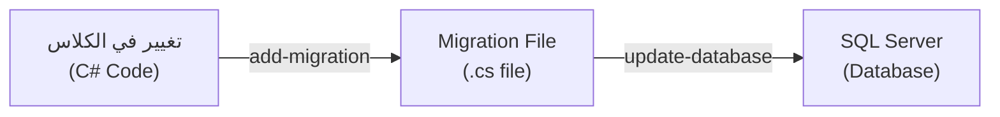

### الـ Commands المهمة:

```powershell
# إنشاء Migration جديدة
add-migration AddEmployeeTable

# تطبيق التغييرات على الداتابيز
update-database

# الرجوع للوراء لـ Migration معينة
update-database [MigrationName]

# إلغاء آخر Migration (قبل update-database)
remove-migration

# إلغاء كل المigrations (الـ 0 يعني الأول)
update-database 0
```

### ملف الـ Migration:

```csharp
public partial class AddEmployeeTable : Migration
{
    protected override void Up(MigrationBuilder migrationBuilder)
    {
        // هنا التغييرات اللي هتتطبق لما تعمل update-database
        migrationBuilder.CreateTable(
            name: "Employees",
            columns: table => new
            {
                EmpId = table.Column<int>(type: "int", nullable: false)
                    .Annotation("SqlServer:Identity", "1, 1"),
                Name = table.Column<string>(type: "nvarchar(50)", maxLength: 50, nullable: false),
                salary = table.Column<decimal>(type: "money", nullable: false),
                Age = table.Column<int>(type: "int", nullable: true),
                Email = table.Column<string>(type: "nvarchar(max)", nullable: false)
            },
            constraints: table =>
            {
                table.PrimaryKey("PK_Employees", x => x.EmpId);
            });
    }

    protected override void Down(MigrationBuilder migrationBuilder)
    {
        // هنا العكس - لما تعمل rollback
        migrationBuilder.DropTable(name: "Employees");
    }
}
```

### شرح `Up()` و `Down()`:

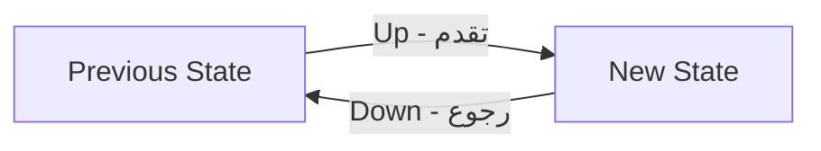

| Method | بتعمل إيه | متى بتتشغل |
|---|---|---|
| `Up()` | بتطبق التغييرات | لما تعمل `update-database` |
| `Down()` | بتعكس التغييرات | لما تعمل `update-database [OldMigration]` |

### اسم ملف الـ Migration:

```
20260324220815_AddEmployeeTable.cs
│              │
│              └── اسم الـ Migration اللي إنت كتبته
└── الوقت اللي اتعملت فيه (yyyyMMddHHmmss)
```

### `__EFMigrationsHistory` جدول في الداتابيز:

لما تعمل `update-database`، EF بيعمل جدول خاص في الداتابيز اسمه `__EFMigrationsHistory` بيحفظ فيه كل الـ Migrations اللي اتطبقت.

```sql
SELECT * FROM __EFMigrationsHistory
-- النتيجة:
-- MigrationId                              | ProductVersion
-- 20260324220815_AddEmployeeTable          | 10.0.0
-- 20260325010357_AddDepartmentsTable       | 10.0.0
```

### Migration Flow الكامل:

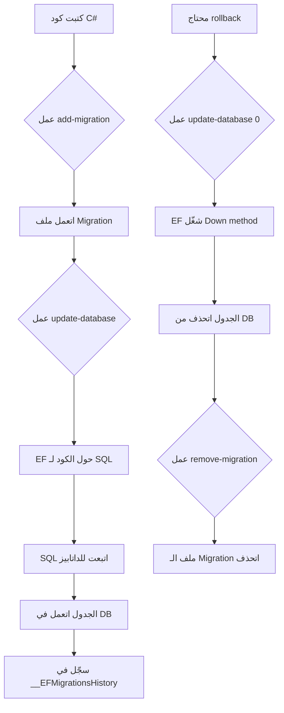

---

## 9. Model Snapshot Explained (شرح الـ ModelSnapshot)

```csharp
[DbContext(typeof(EnterpriseDBContext))]
partial class EnterpriseDBContextModelSnapshot : ModelSnapshot
{
    protected override void BuildModel(ModelBuilder modelBuilder)
    {
        // صورة كاملة من الـ Model الحالي
    }
}
```

### إيه هو الـ ModelSnapshot؟

الـ ModelSnapshot ده "صورة" من الـ Model بتاعك في آخر حالة. EF بيقارن الكود الجديد بتاعك بالـ Snapshot عشان يعرف إيه اللي اتغير وييعمل Migration مناسبة.

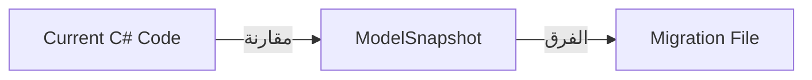

**مثال:** لو عندك `Department` وزودت عليها Column جديد اسمه `Location`:
1. EF بيشوف الـ Snapshot القديم: مفيش `Location`
2. بيشوف الكود الجديد: فيه `Location`
3. بيعمل Migration بـ `AddColumn("Location"...)`

---

## 10. Entity States Explained (شرح حالات الـ Entity)

كل Object بتتعامل معاه عنده "حالة" - بتعبر عن علاقته بالداتابيز.

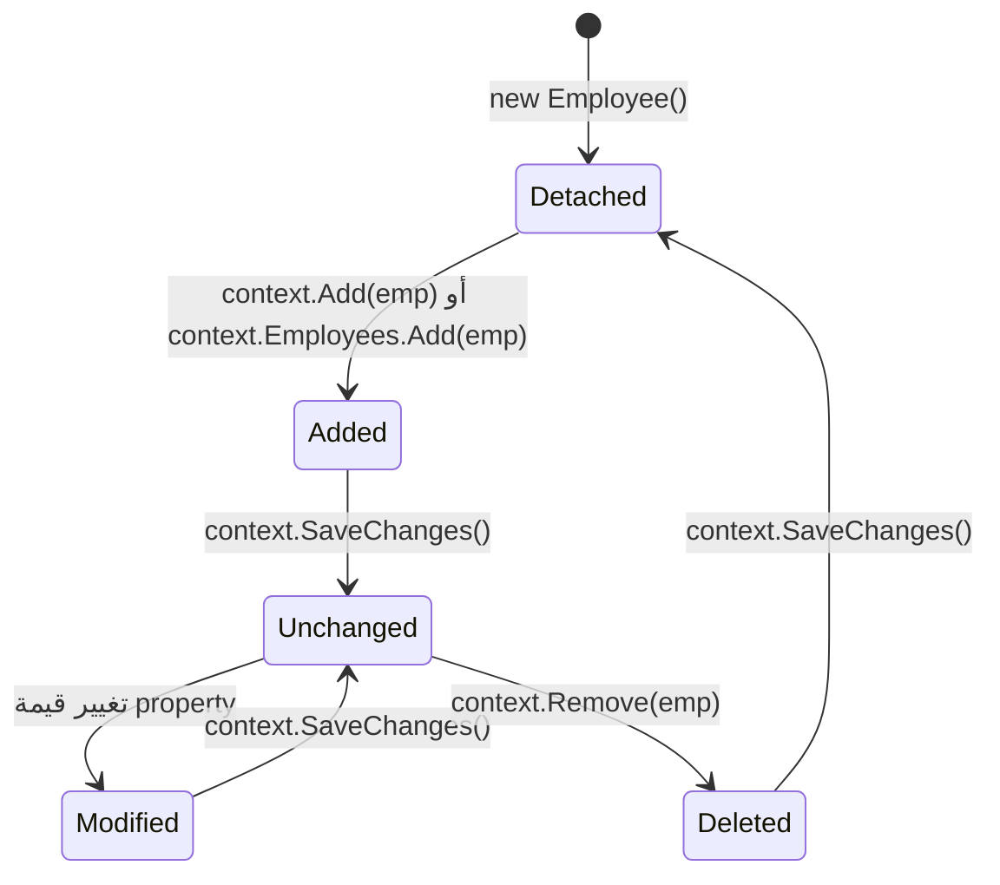

### شرح كل حالة:

#### 1. Detached (منفصل)
```csharp
Employee employee = new Employee { Name = "Ibrahim" };
Console.WriteLine(context.Entry(employee).State); // Detached
```
الـ Object موجود في الـ Memory بس EF مش عارف عنه حاجة.

#### 2. Added (متضاف)
```csharp
context.Employees.Add(employee);
Console.WriteLine(context.Entry(employee).State); // Added
```
EF بيعرف إن الـ Object ده جديد ومش موجود في الداتابيز. لما تعمل `SaveChanges()` هيعمله INSERT.

#### 3. Unchanged (ما تغيرش)
```csharp
context.SaveChanges(); // بعد الـ Add
Console.WriteLine(context.Entry(employee).State); // Unchanged
```
الـ Object موجود في الداتابيز وما تغيرش. EF مش هيعمل حاجة لما تعمل `SaveChanges()`.

#### 4. Modified (اتعدّل)
```csharp
employee.Email = "newemail@gmail.com";
Console.WriteLine(context.Entry(employee).State); // Modified
```
EF شايف إن الـ Property اتغيرت. لما تعمل `SaveChanges()` هيعمل UPDATE.

#### 5. Deleted (متحذف)
```csharp
context.Employees.Remove(employee);
Console.WriteLine(context.Entry(employee).State); // Deleted
```
EF عارف إن المفروض يحذف الـ Object ده من الداتابيز. لما تعمل `SaveChanges()` هيعمل DELETE.

### إزاي تغير الـ State يدوياً؟

```csharp
context.Entry(employee).State = EntityState.Added;   // بدل context.Add()
context.Entry(employee).State = EntityState.Modified; // بدل التعديل + SaveChanges
context.Entry(employee).State = EntityState.Deleted;  // بدل Remove()
```

---

## 11. CRUD Operations Explained (شرح عمليات الإضافة والتعديل والحذف والقراءة)

### أ) INSERT (إضافة)

```csharp
using (EnterpriseDBContext context = new EnterpriseDBContext())
{
    Employee employee = new Employee()
    {
        Name = "Ibrahim2",
        Age = 26,
        Email = "Ibrahim.Shafiq440@gmail.com",
        salary = 50000
        // ما بنحطش الـ EmpId لأنه Identity في الداتابيز
    };
    
    // 4 طرق للإضافة (كلهم بيعملوا نفس الحاجة):
    context.Employees.Add(employee);           // الطريقة الشائعة
    // context.Add(employee);                  // لو مش عندك DbSet
    // context.Set<Employee>().Add(employee);  // نفس الأولانية
    // context.Entry(employee).State = EntityState.Added; // يدوي
    
    context.SaveChanges(); // دلوقتي البيانات اتحفظت في الداتابيز
}
```

**الـ SQL اللي بيتعمل:**
```sql
INSERT INTO [Employees] ([Name], [salary], [Age], [Email])
VALUES ('Ibrahim2', 50000, 26, 'Ibrahim.Shafiq440@gmail.com')
```

### ب) UPDATE (تعديل)

```csharp
using (EnterpriseDBContext context = new EnterpriseDBContext())
{
    // أولاً: جيب الـ Employee من الداتابيز
    var result = context.Employees.FirstOrDefault(emp => emp.EmpId == 2)!;
    
    // ثانياً: عدّل على الـ Property
    result.Name = "Shafiq";
    
    // الـ State بقى Modified أوتوماتيك
    Console.WriteLine(context.Entry(result).State); // Modified
    
    // ثالثاً: احفظ التغييرات
    context.SaveChanges();
    
    Console.WriteLine(context.Entry(result).State); // Unchanged
}
```

**الـ SQL اللي بيتعمل:**
```sql
UPDATE [Employees]
SET [Name] = 'Shafiq'
WHERE [EmpId] = 2
```

### ج) DELETE (حذف)

```csharp
using (EnterpriseDBContext context = new EnterpriseDBContext())
{
    // أولاً: جيب الـ Employee من الداتابيز
    var result = context.Employees.FirstOrDefault(emp => emp.EmpId == 5)!;
    
    // ثانياً: احذفه (4 طرق):
    context.Employees.Remove(result);
    // context.Remove(result);
    // context.Set<Employee>().Remove(result);
    // context.Entry(result).State = EntityState.Deleted;
    
    Console.WriteLine(context.Entry(result).State); // Deleted
    
    // ثالثاً: احفظ التغييرات
    context.SaveChanges();
    
    Console.WriteLine(context.Entry(result).State); // Detached (اختفى من الـ tracking)
}
```

**الـ SQL اللي بيتعمل:**
```sql
DELETE FROM [Employees]
WHERE [EmpId] = 5
```

### د) SELECT (قراءة)

```csharp
using (EnterpriseDBContext context = new EnterpriseDBContext())
{
    // جيب بيانات محددة باستخدام LINQ
    var employees = context.Employees
        .Select(e => new { name = e.Name, Email = e.Email, id = e.EmpId });
    
    foreach (var emp in employees)
    {
        Console.WriteLine(emp);
    }
}
```

**الـ SQL اللي بيتعمل:**
```sql
SELECT [Name], [Email], [EmpId]
FROM [Employees]
```

---

## 12. Connection String Explained (شرح الـ Connection String)

```csharp
"server=IBRAHIMSHAFIQ\\SQLEXPRESS; database=EnterpriseDb; Trusted_Connection=true; TrustServerCertificate=true;"
```

### الطريقة الأولى (اللي بنستخدمها):
```
server=[اسم الجهاز]\\[اسم الـ Instance]
database=[اسم الداتابيز]
Trusted_Connection=true
TrustServerCertificate=true
```

### الطريقة التانية (نفس النتيجة):
```
data source=[اسم الجهاز]\\[اسم الـ Instance]
initial catalog=[اسم الداتابيز]
integrated security=true
```

### إزاي تلاقي اسم الـ Server؟

1. افتح **SQL Server Management Studio (SSMS)**
2. على اليسار، كليك يمين على اسم الـ Server
3. اختار **Properties**
4. هتلاقي اسم الـ Server

**أو** ممكن تستخدم `.` بدل اسم الجهاز:
```
server=.\SQLEXPRESS
```

---

## 13. Why we use `using` with DbContext (ليه بنستخدم using؟)

```csharp
using (EnterpriseDBContext context = new EnterpriseDBContext())
{
    // كودك هنا
} // هنا بيتعمل Dispose أوتوماتيك
```

### إيه هو `using`؟

الـ `using` statement بيضمن إن أي resource بتستخدمه هيتحرر بعد ما تخلص منه.

### ليه مهم مع DbContext؟

الـ DbContext بيفتح Connection مع الداتابيز. لو نسيت تعمله Dispose، الـ Connection هيفضل مفتوح ويضيع resources.

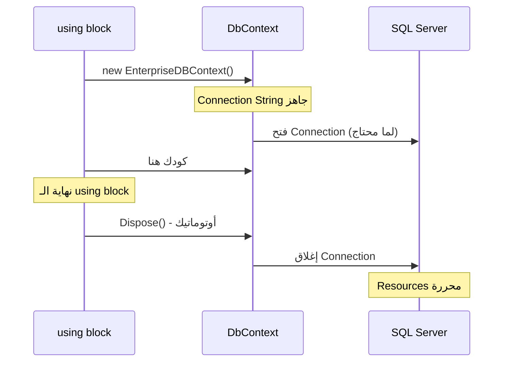

### الـ `using` بيعمل إيه داخلياً؟

```csharp
// الـ using بيتحول لـ try-finally
EnterpriseDBContext context = new EnterpriseDBContext();
try
{
    // كودك هنا
}
finally
{
    context.Dispose(); // دايماً بيتنفذ حتى لو حصل Error
}
```

### `IDisposable` إيه ده؟

الـ `DbContext` بيـ implement الـ `IDisposable` interface. ده Interface فيه method واحدة بس هي `Dispose()`. لما تستخدم `using`، C# بيعمل `Dispose()` أوتوماتيك في النهاية.

---

## 14. Internal EF Core Pipeline (الـ Pipeline الداخلي لـ EF Core)

### إزاي EF Core بيشتغل من جوه؟

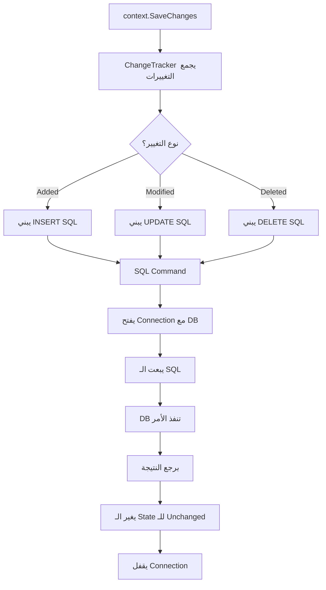

### إزاي EF بيحول LINQ لـ SQL؟

```csharp
// الكود بتاعك
var employees = context.Employees
    .Where(e => e.Age > 25)
    .Select(e => new { e.Name, e.Email });

// EF Core بيحوله لـ:
// SELECT [Name], [Email] FROM [Employees] WHERE [Age] > 25
```

EF Core عنده **Query Translator** بيحول LINQ Expressions لـ SQL Queries.

---

## 15. Database Schema Diagram (رسم الـ Schema)

### الجداول اللي اتعملت:

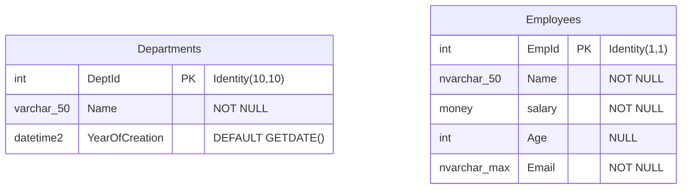

### جدول مقارنة النتائج في الداتابيز:

**Departments Table:**
| Column | Type | Nullable | Default | Identity |
|---|---|---|---|---|
| DeptId | int | NOT NULL | - | IDENTITY(10,10) - PK |
| Name | varchar(50) | NOT NULL | - | - |
| YearOfCreation | datetime2 | NOT NULL | GETDATE() | - |

**Employees Table:**
| Column | Type | Nullable | Default | Identity |
|---|---|---|---|---|
| EmpId | int | NOT NULL | - | IDENTITY(1,1) - PK |
| Name | nvarchar(50) | NOT NULL | - | - |
| salary | money | NOT NULL | - | - |
| Age | int | NULL | - | - |
| Email | nvarchar(max) | NOT NULL | - | - |

---

## 16. Comparison Table (جدول المقارنة بين الـ 3 طرق)

| Feature | Convention | Data Annotation | Fluent API |
|---|---|---|---|
| **Primary Key** | Property اسمها `Id` أو `EntityId` | `[Key]` | `HasKey(e => e.Id)` |
| **Required** | Value Types أوتوماتيك | `[Required]` | `.IsRequired()` |
| **Max Length** | - | `[MaxLength(50)]` | `.HasMaxLength(50)` |
| **Table Name** | اسم الـ DbSet | `[Table("Name")]` | `.ToTable("Name")` |
| **Column Type** | EF يختار | `[Column(TypeName="money")]` | `.HasColumnType("money")` |
| **Default Value** | - | - | `.HasDefaultValueSql("GETDATE()")` |
| **Unicode** | true | - | `.IsUnicode(false)` |
| **Identity Seed** | (1,1) | `[DatabaseGenerated]` | `.UseIdentityColumn(10,10)` |
| **Validation** | لا | نعم (Range, Email...) | لا |
| **Code Location** | في الكلاس (ضمني) | في الكلاس (Attributes) | في DbContext أو Config Class |
| **Readability** | ممتاز | كويس | محتاج وقت للتعلم |
| **Flexibility** | محدود | متوسط | كامل |
| **Best For** | بداية سريعة | POCO + Validation | Complex Configurations |

---

## 17. Summary (الخلاصة)

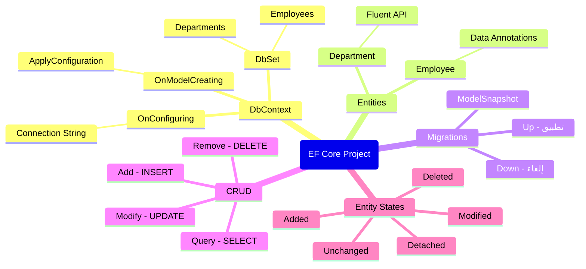

### الـ Flow الكامل من الكود للداتابيز:

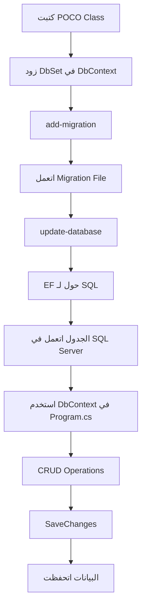

### النقط المهمة:

1. **DbContext** هو الوسيط بين كودك والداتابيز
2. **DbSet** هو بوابتك للجدول
3. **Migration** هو اللي بيحول كودك لـ SQL
4. **ChangeTracker** هو اللي بيراقب التغييرات
5. **SaveChanges** هو اللي بيبعت التغييرات للداتابيز فعلاً
6. **using** بيضمن إن الـ Connection يتقفل أوتوماتيك
7. **Entity States** بتعبر عن علاقة الـ Object بالداتابيز

---